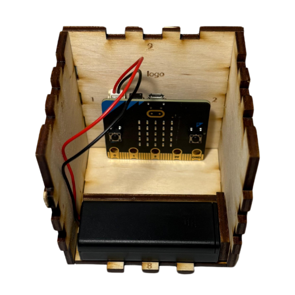
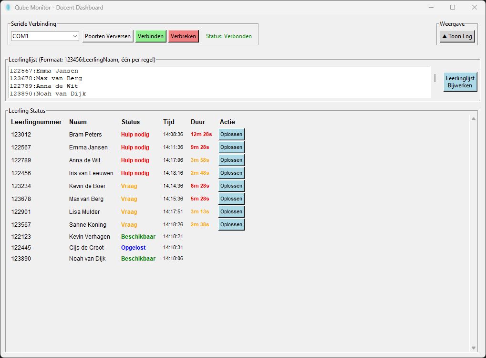

# Leerdobbelsteen - de Qube

Dobbelsteen die wanneer hij van oriëntatie verandert verschillende signalen doorstuurt naar de docent, die vervolgens op zijn computer alles kan inzien en kan helpen waar nodig.

In opdracht van Rolf Hut gemaakt. [ClassroomIndicatorLights](https://github.com/RolfHut/ClassroomIndicatorLights/) is aangepast voor gebruik op de middelbare school in plaats van universiteit.

## Hoe ziet de Qube eruit?

Hieronder zie je een foto van de binnenkant van de Qube. Als de oriëntatie veranderd heeft de microbit het door en verstuurd een radio-signaal. Op de buitenkant staat wat het verstuurde signaal is voor een bepaalde oriëntatie. Bijvoorbeeld als rood boven ligt, heeft de leerling dringend hulp nodig.

  

## Voorbeeld van het dashboard

Zo ziet de Qube Monitor App eruit in gebruik.

  

