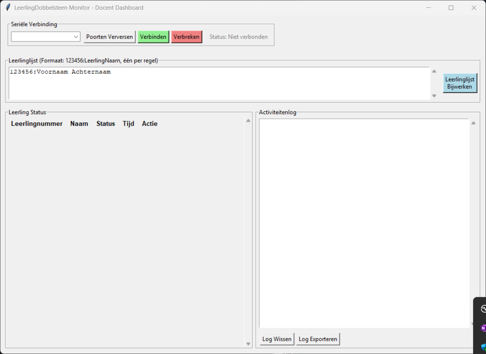

# Lerarenapp

Dit is het dashboard waar je alle verbonden leerlingen kan zien met een "Qube". De leerlingnummers van de klas die je wilt ontvangen moet je wel invullen, dus we raden aan een bestand aan te maken voor elke klas zodat je het snel kan copy-pasten.

De LerarenMicrobit moet echter wel aangesloten zijn op de computer om het te laten werken!

Voorbeeld dashboard

