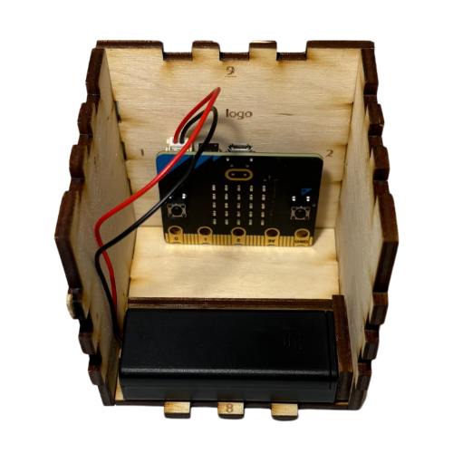

# Qube Microbit

[Open het Microbit project in MakeCode](https://makecode.microbit.org/S75591-81935-61536-36336)

De microbit wordt in een dobbelsteen geplaatst. Wanneer de oriëntatie verandert, wordt een radio-signaal gestuurd naar de LerarenApp. Het leerlingnummer wordt van tevoren ingesteld.

## Binnenkant van de Qube

Hieronder zie je een foto van de binnenkant van de Qube:

  

## Handleiding

Zie het bestand `Handleiding-microbit.md` voor meer informatie over het instellen en gebruiken van de Qube Microbit. En zie het bestand `Handleiding QUBE.pdf` voor meer informatie over het in elkaar zetten

